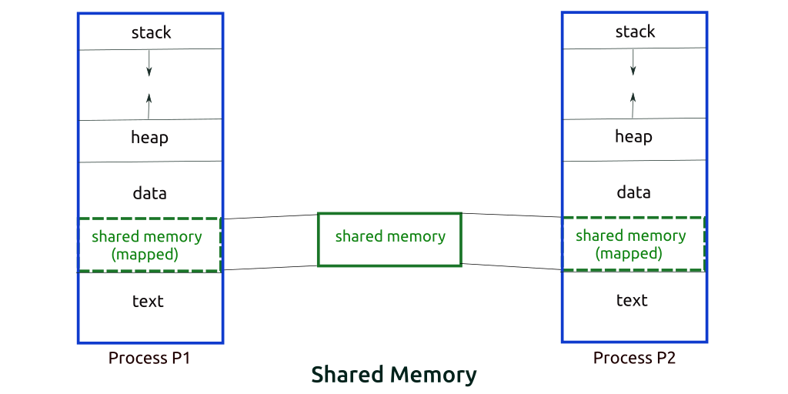

# Concurrency
Process A needs locks 1 and 2; Process B needs locks 2 and 3
- A will not continue until it has both locks and B will not continue until it has both locks; This leads to a deadlock as both processes will block until they get both locks.

Deadlocks will typically occur in OS

Forked processes share physical memory
- All child processes can read as often as they want without worry of it changing

Copy-On-Write (COW): Child process will still have access to the shared memory of all other child processes, but will also have it's own allocated memory

SHM (Shared Memory): Allocated memory that everything shares

Issues with SHM
1) Process **Contention**: Multiple processes might try to write to the same location at the same time; This is only a problem with writing.

Contention
- Locking = In the Text section as Critical Section
- If we're writing to 0x1000, we need to lock to prevent other processes from reading/writing from/to it.

Locks
1) Semaphores
   - Semaphore puts an upper bound on how many processes can access the data (int i = 4)
   - Down = acquire the lock, decrement the integer
        1) If i (semaphore value) > 0 -> decrement i, have the lock
        2) If i = 0 -> Wait for lock. Waiting can be spin lock or sleeping the process
   - Up = release the lock, increment the integer
        1) Increment i by 1
2) Mutex (Mutual Exclusion)
   - Mutex = Semaphore that goes from 0 to 1
   - Just like semaphore, except it allows only ONE process into the critical section at once.
3) Barrier
   - Ordering; Similar to a semaphore where there is a value and has a finish point
   - **INSERT example from class**

Semaphores and Mutexes are practically the same thing

IPC (Inter-process Communications): Pipes/Sockets/etc.

AMO (Atomic Memory Operations): Atomic instruction cannot be preempted.
- amoswap is meant for mutexes; Takes three params (dest, src, and address)
  - amoswap.w.aq t0, t1, (a0)

Rules of locking:
- Only one writer
- No readers and writers

Rules of ordering:
- Want to maximize readers; Get as many readers done as possible
  - Writing takes more work, so reading will be maximized

**INSERT NOTES FROM FRIDAY**

RCU (Read-Copy-Update)

- Prevents user from locking

**INSERT GRAPH FROM CLASS**

## Dining Philosophers

## BKL (Big Kernel Lock)
## Clicker Questions
1) How many bytes is the MTVEC (Machine trap vector) aligned by? 4 bytes
2) Which register stores what instruction we return to when an instruction is interrupted? MEPC
3) Where is the fetch instruction stored? RAM