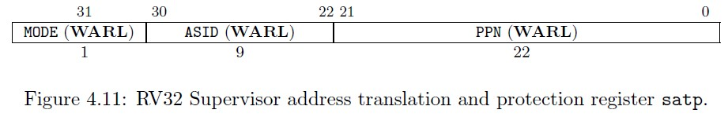

# MMU

Responsible for translating virtual addresses to physical addresses

MMU provides translation and protection

- Can set to read-only, write-only, present, not present

MMU/PPN (Physical Page Number) translates everything but the lower 12 bits

- 0x12345678 => 0x12345000
- 0x42341234 => 0x42341

Cannot store root page table to 0x1234_5678 because 678 will be dropped

## SATP (Supervisor Address Translation and Protection)

SATP points to the very top of the page table

To get VPN[1] of the sv32 virtual address, need to get last 10 bits (bits 22-31).
- Will use a mask of 0x3ff

Give decimal value of VPN[1], VPN[0], and the page offset of the address 0xdeadbeef:
VPN[1] = 890
VPN[0] = 731
page offset = 0xeef

Get VPN[1], VPN[0], and the page offset of 0x1ab2_cdef
VPN[1] = 106
VPN[2] = 812
Page Offset = 3567

## Clicker Questions

1) What data structure is the RCU (Read-Copy-Update) made of? Linked List
2) All page numbers are aligned to what number/multiple/byte? 4096
3) If mode is set to 0 (bit 31) for the SATP, what address is given? Physical address
    - No translation is done, thus given the actual address of the table
4) How many number of bits will the register be aligned by? 12 bits