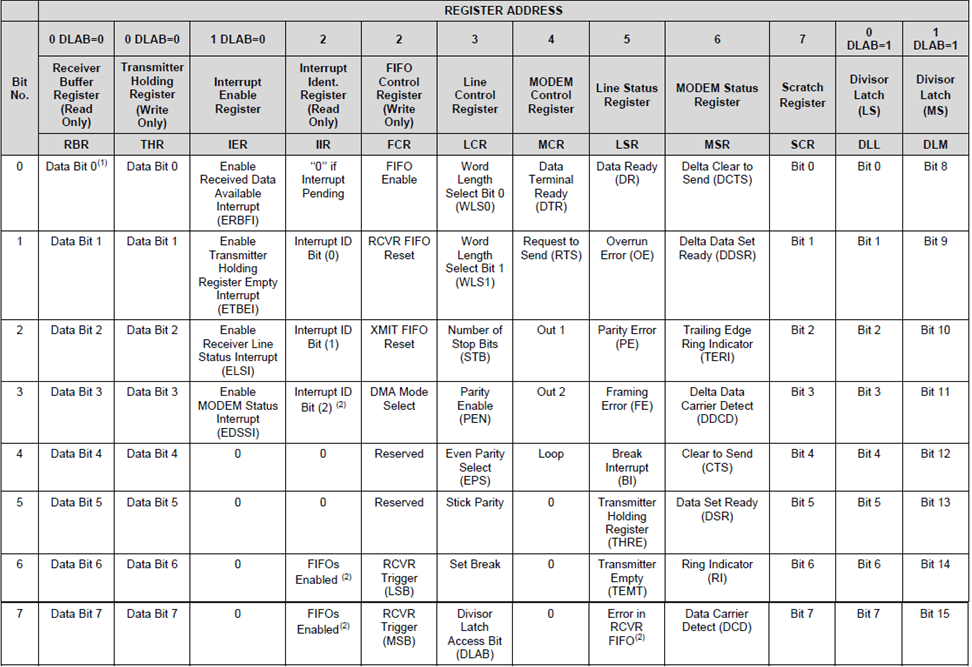

# Lab 2

## Assignment
You will be creating a UART (Universal Asynchronous Receiver Transmitter) driver for MZOS (Marz OS). The point of this lab is to learn how to control hardware from an operating system. The programming part requires no more knowledge than pointers and pointer arithmetic.

You must use my tools on the Hydra/Tesla machine for this operating system. Add the following to your path:

```bash
/home/smarz1/Programs/riscv/bin
```

## Functions to Write

You will need to write the following functions to perform the given operations:

```cpp
void init()
```

This function will initialize the NS16550a chipset by setting the divisor to handle a baud rate of 115,200. The UART chip is clocked with an oscillator at a frequency of 18 MHz. After you set the divisor, you must set the NS16550a to receive 8-bit data and odd parity. In essence, you need to clear the divisor latch access bit.

The formula for determining the divisor is as follows:

```cpp
F_baud = F_in / (divisor + 1)
```

F_baud is the BAUD frequency. F_in is the input (oscillator) frequency.

```cpp
char read_char()
```

This function will read a single character and returns it. If the UART RX FIFO is empty, return 0 (or '\0').

```cpp
void write_char(char c)
```

This function will write the character, c, to the UART TX FIFO. If the TX FIFO is full, loop until it becomes available. This function must not return until the character is written.

```cpp
void write_string(const char *out)
```

This function will write the c-style string, out, to the UART TX FIFO. Remember that a c-style string is simply an array of characters. Write each character until you reach a NULL terminator. DO NOT write the NULL terminator to the UART TX FIFO.

```cpp
void write_stringln(const char *out)
```

This function will write the c-style string, out, to the UART TX FIFO, and then it will write the string literal "\r\n" to the UART TX FIFO.

```cpp
void extract_two_numbers(int &left, int &right, bool echo)
```

This function will read from UART using read_char and extract two numbers. It will not return until two numbers are read. Furthermore, if echo is true, this function will need to echo back the user's input by writing the inputted character back to the user. You do NOT need to handle backspaces or any other non-digit characters except spaces. Make sure you handle negative numbers.

```cpp
void to_string(char *dest, int value)
```

This function will convert an integer value into a string called dest. You may assume that the memory that dest points to is large enough to store all of value's digits and a sign (if applicable). Make sure you handle negative numbers!

**WARNING**: To test your functions individually, you must at least have "shells" of ALL of the functions, otherwise your kernel won't compile. Until you properly write write_string and write_stringln, you won't see anything if you type 'make run'. Therefore, write_string, write_char, and write_stringln should be the first functions you write.

## Files

Download the following files, store them in the same directory, and create a .cpp file for your functions above:

```bash
libmzos.a
Makefile
virt.lds
```

## National Semiconductor 16550a UART Controller

You will be programming the ns16550a chipset for the UART driver. This is a fully MMIO (memory mapped I/O) chipset and is based at the memory address: 0x10000000. All registers are at base + offset.

The following table describes the NS16550a registers (each register is exactly 8-bits [1-byte]):

| Offset | Read/Write | Description                       |
| ------ | ---------- | --------------------------------- |
| 0x00   | Read-only  | RBR: Receiver Buffer Register     |
| 0x00   | Write-only | THR: Transmitter Holding Register |
| 0x00   | Read/Write | DLL: Divisor Latch Register (LSB) |
| 0x01   | Read/Write | DLM: Divisor Latch Register (MSB) |
| 0x03   | Read/Write | LCR: Line Control Register        |
| 0x05   | Read-only  | LSR: Line Status Register         |

### RBR Register
The RBR register will hold 8-bits (conveniently, the size of a char) of the data received. You will use this register to read the input from the user. As soon as you read from this register, the next 8-bits from the FIFO will be put into this register. Therefore, there is no additional "method" to pop the top of the RBR register.

### THR Register
The THR register will hold 8-bits of the data to transmit. You will use this register to send data to user's console. When you directly write to this register, it will push the 8-bits to the TX FIFO. Therefore, there is no additional "method" to push the data from the THR register.

### DLL Register
The DLL register contains the least significant 8 bits of the divisor latch. This will hold the lower 8 bits of your divisor number.

### DLM Register
The DLM register contains the most significant 8 bits of the divisor latch. This will hold the upper 8 bits of your divisor number.

### LCR Register
The LCR register can take the following bit locations: 8BIT (0x03), DLAB (0x80), and PODD (0x08). 8 bit forces the UART to handle 8-bits. Otherwise, it will handle 7-bits. DLAB stands for Divisor Latch Access Bit. If DLAB is set, then offset 0 will be the DLL register and offset 1 will be the DLM register. If DLAB is cleared, then offset 0 will be the RBR/THR registers (depending on if you're reading or writing) and offset 1 will be the IER interrupt enable register (not used in this lab). The PODD bit means "Parity Odd". This allows for parity on the UART line. If the number of 1s in the 8-bit sequence is odd, then the parity bit will be 1. Otherwise, it will be 0. This is a simple, and a bit ineffective, way to determine if the bits have changed during transmission.

### LSR Register
The LSR register can take the following bit locations: DA (0x01) and TEMT (0x40). DA will be non-zero if data is available to be read (read_char), and it will be zero, otherwise. TEMT will be 1 if the TX FIFO is empty and it will be 0 otherwise. Do NOT write to the TX FIFO unless it is empty!

Here's the register map from the NS16550a technical document:



## Restrictions

1. Do not include ANY headers.

2. You must program this in a baremetal environment (hence the freestanding, nostdlib, and nostartfiles given to the compiler).

3. Do NOT use ANY floating point operations. All arithmetic must be performed using integers, only.

4. Do NOT duplicate code.

5. Use constants when necessary. For example, do not hardcode 18 MHz. Expect that we may use different baud rates or frequencies.

6. You must write this in C++. The function names are expected to be mangled.

7. If you put in the wrong divisor into the DLL and DLM registers, the emulator will still work. However, the hardware will not. Make sure you provide the proper numbers for all aspects of the initialization process.

8. Do NOT use global variables. Global constants are fine, but the compiler gets confused with global variables in certain cases.

## Compiling and Testing

Use 'make' to make your cs361_kernel.elf file (this is the file that will be created). This will be your operating system. The file libmzos.a contains the startup code to get the RISC-V CPU started and use your UART functions to get and send data.

You should see the following:
```bash
make run
qemu-system-riscv32 -machine virt -m 128M -nographic -smp 2 -serial mon:stdio -kernel cs361_kernel.elf
COSC361 OS Menu!
Type Control-a, x to quit
 1 - Print "hello world"
 2 - Annoy me
 a - Add two numbers.
 s - Subtract two numbers.
 m - Multiply two numbers.
 d - Divide two numbers.
 x - Secret numbers.
Enter command:
```

When you press 1, you should see:
```bash
Enter command:
hello world!

COSC361 OS Menu!
Type Control-a, x to quit
 1 - Print "hello world"
 2 - Annoy me
 a - Add two numbers.
 s - Subtract two numbers.
 m - Multiply two numbers.
 d - Divide two numbers.
 x - Secret numbers.
Enter command:
```

If you press a math key, such as a, s, m, or d (in the case below, I pressed a for add):
```bash
Enter command:
Enter two numbers: 10 40

10 + 40 = 50

COSC361 OS Menu!
Type Control-a, x to quit
 1 - Print "hello world"
 2 - Annoy me
 a - Add two numbers.
 s - Subtract two numbers.
 m - Multiply two numbers.
 d - Divide two numbers.
 x - Secret numbers.
Enter command:
```

If you press a key not in the menu, you will see:
```bash
+-+-+ Unknown command +-+-+

To exit the OS, hold down control and press a, release all keys, and then press x. If you did it correctly, it should print the following and return back to your prompt:

COSC361 OS Menu!
Type Control-a, x to quit
 1 - Print "hello world"
 2 - Annoy me
 a - Add two numbers.
 s - Subtract two numbers.
 m - Multiply two numbers.
 d - Divide two numbers.
 x - Secret numbers.
Enter command: QEMU: Terminated
~>
```

## Submission

Make sure all of your functions are in a single .cpp file, and then submit that .cpp file. Your file must compile on the Tesla/Hydra machines. If it does not, you will not receive credit for this lab!
