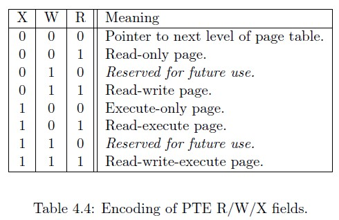

# Lab 4

## Overview
You will be writing a few functions required to implement the Sv32 memory management unit. This time, MZOS has both kernel and user space. Therefore, it is required that your code map/unmap and switch MMU pages to make sure that all user space lives in user space, and that all kernel space lives in kernel space.

The SATP and Sv32 MMU strategies can be found here: [riscv-mmu.pdf](riscv-mmu.pdf)

## Files
```bash
Makefile
libmzos.a
virt.lds
mmu.h
mmu.cpp
```

## Assignment
You will need to write the following functions to perform the given operations in mmu.cpp:

```cpp
void mmu_disable()
```
This function will turn off the MMU by changing the SATP's mode. DO NOT change anything other than the mode bit!

```cpp
void mmu_enable(PROCESS *p)
```
This function will enable the MMU for the given process. Remember, there is a context switching mechanism, so your mmu_enable must handle any process that needs to be enabled. This function must do nothing if p->mmu_table is == 0.

```cpp
void mmu_map(PROCESS *p)
```
This function will map a process' program pointer and stack pointer into the MMU. This is typically used for USER mode processes, but may also be used for SUPERVISOR processes. NOTE: This function does NOT change SATP. Instead, it will write the root table into p->mmu_table.

```cpp
void mmu_unmap(PROCESS *p)
```
This function will completely unmap a process from the MMU. Essentially, it needs to free the memory associated with p->mmu_table by making those entries non-valid (V bit must be 0).

```cpp
void test()
```
This function is called from the init() process. You can use new_process (prototyped in mmu.h) to create new processes to test your code.

## Programming the MMU
You will program the MMU by adding page tables into memory, and then setting the SATP register to point to the root table in memory. NOTE: The last 12 bits of your tables' physical address must be 0! Notice, you only store the upper 20 bits of the table in the SATP register. Finally, bit 31 is the MODE field of the SATP register. If this is 0, the MMU is turned off. Otherwise, if this is 1, the MMU is activated.

### *SATP Register*

*WARL means "Write Any Values, Reads Legal Values", which essentially means that you can write any value and then see what the register actually took by reading it back.

### *Virtual / Physical / Page Entry*


### *RWX Fields*


## Hints and Restrictions

1. You will notice a global table called MMU_TABLE. This is where your MMU tables will go. Remember, the SATP register only stores the upper 20 bits of the root table's memory address. Therefore, you must align the memory address so that the last 12 bits are 0 (32-12 = 20).

2. For mmu_map, p->program points to the start of the program's memory address. You are guaranteed that no program will exceed 4096 bytes (1 page), except perhaps ones that you make. However, you are not guaranteed that you only need to map 1 page. For example, if my program starts at 0x8000_2fff, it can potentially reach 0x8000_3fff. However, in this case, you will need to map 2, 4-kb pages. One for 0x8000_2xxx and one for 0x8000_3xxx.

3. The stack size has the same restriction as the program pointer. However, the stack size for every program is exactly 8096 bytes, which may be 2 or more pages.

4. You may see page fault error messages should you not map correctly. (See Output section)

5. You will notice that MMU_TABLE_SIZE controls the MMU_TABLE array, and you have enough space for 10 table entries. Therefore, you must implement the LRU algorithm to see which page can be replaced. Remember to swap entries in your mmu_enable() function.

6. Do NOT let processes share MMU_TABLES. Even though this is good practice to coalesce adjoining pages, you will not be doing this.

7. Do NOT use 4MiB super pages. All of your pages will be 4KiB pages.

8. You must use the Sv32 (32-bit MMU) system.

9. Your address space identifier (ASID) must always be 0.

## Outputs

Page faults can arise from three different ways: IPF (Instruction Fetch Page Fault), LPF (Load Page Fault), or SPF (Store Page Fault). These will be denoted with a #IPF, #LPF, or #SPF.
```
Welcome to Marz OS (Lab 4)
 e - Make ECALL.
 p - Process list (as USER).
 q - Process list (as MACHINE).
 t - Top (as USER).
 u - Top (as MACHINE).
 0 - Run YOUR test() function.
Enter command: Killing process PID 5. => #IPF (mtval = 0x80000324)
```
In the code above, I typed 0, which created a user process, but I did not map the program pointer correctly. You can see the program pointer is 0x8000_0324. You know that this is a problem with the program pointer and not the stack since it is an #IPF (Instruction Fetch Page Fault). Otherwise, it will be an #LPF or #SPF depending on whether the stack was loaded from or stored to.

### *Process List*

This screenshot shows twelve processes. You will notice that my code has the same MMU TABLE address. This is because my code coalesces like entries. However, your code will not do this. Instead, each USER process must have a distinct MMU TABLE address.

Each column represents the following:
| Name | Description |
| ---- | ----- |
| PID | The process ID. Currently, this can be 1 through 15. No more than 15 processes are allowed. |
| STATE | The state of the process: RUNNING or SLEEPING |
| QM | Quantum multiplier. This is the amount of additional runtime a process gets per switch. |
| PR | Priority. Unused for round robin scheduling. |
| SL | Sleep timer. The process in SLEEPING mode will sleep until the timer reaches this value. |
| SW | The number of context switches this process has received. |
| RT | The amount of CPU time this process has received. |
| PRIV. MODE | The privilege mode the process is running: MACHINE, SUPERVISOR, or USER |
| MMU TABLE | The address of the MMU table for this process.
| NAME | The name of this process. |

## Compiling and Running

Compile and run your program using the following command:
```bash
make run
```

## References
[riscv-mmu.pdf](riscv-mmu.pdf)

## Submission

Submit your .cpp file. Your solution must compile and run on the Hydra machines.