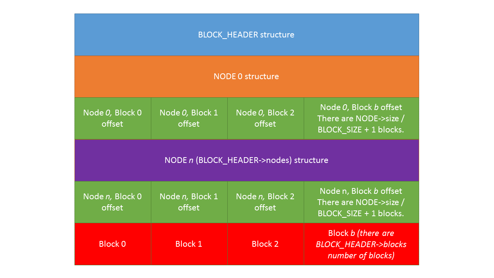

# Lab 5

This project is all about implementing a file system in a true environment. You will be using a kernel module and library called FUSE--Filesystem in Userspace. This is a real filesystem in Linux and works with the Hydra machines. You will be writing several functions that read and write to a block file and allow the user to interact with your filesystem.

You will need to use the Hydra machines as it has the fuse libraries on it (or your own, but then the Makefile won't work for you).

## Step 1

All of the files you'll need are in /home/smarz1/Develop/cs361/fuse/ on any Hydra, Tesla, or Arc machine.

Take a look at the [Filesystem_Functions.pdf](Filesystem_Functions.pdf) file for a description of each function.

Copy Makefile, fs.cpp (you must use a .cpp file, even though you may write it as if it were C), and fs.h into your local directory. You'll also want to create a fresh, new simulated hard drive by using

```bash
/home/smarz1/Develop/cs361/fuse/makeblock/makeblock [path_to_your_folder]/hard_drive
```

The fs.cpp looks for hard_drive as the hard drive in the format given in fs.h. Makeblock will make sure that your hard drive is given permissions to your username, otherwise, the permissions are set to my username and group id, which will give you no write permissions in your own block file!

The Makefile will automatically create a mnt folder which is where your file system will be mounted when you run your program. Your program will take no arguments, but it expects to automatically load hard_drive and mount to mnt. I turned off the "fork" mode, so it stays open for you to try your hand at your file system.

## Step 2

You will notice that there are several incomplete functions. You will be putting your code in these functions to get your filesystem to do "things". However, the first thing you should do is write `fs_drive()`. This will give you the basis for reading/writing your block drive, and test your understanding of the block file layout (depicted below). You can also read `makeblock.cpp` in `/home/smarz1/Develop/cs361/fuse/makeblock/` to see how I wrote 5 separate nodes and three separate blocks into the hard_drive file. Notice also that the root "/" is a directory node all by itself. When you mount this to /home/yournetid/mnt, your mnt will inherit the stat information from / (uid, gid, permissions, etc).

There are 16 total functions you will need to implement, each one is provided as a shell in fs.cpp. To get a rudimentary filesystem going (without read/write), you need to implement: `fs_drive`, `fs_readdir`, `fs_getattr`, and `fs_opendir`. After you write these functions correctly, you can test your file system...even though it won't really do anything, but if you implemented them correctly, you will see files and directories in your mounted directory.

## Step 3

When you run your program, it will automatically mount itself to the mnt directory in the current directory (make will automatically create this); however, you will need to chmod 777 the mnt directory for fs to mount it properly. The program is set to run in the foreground, so to test, open a session to the exact same Hydra machine, change directories into your mnt folder. When you ls, you should see fs_getattr being called in the fs function. You will undoubtedly cause problems with the underlying FUSE module, so you'll need to be a tiny bit careful. Luckily, FUSE is very robust and doesn't let you mess things up too badly.

If your code SEGFAULTS: You may need to manually unmount your file system by typing

```bash
/usr/bin/fusermount -u mnt
```

fusermount allows users to unmount, -u means unmount, and mnt is the folder where your filesystem is mounted. The Hydra machines have a bit of a flaw in their FUSE system. You have to make sure that there is a readable path all the way to your mnt folder. Typically issuing

```bash
chmod 777 . && fusermount -u mnt && chmod 700 .
```

should do the trick. If all works, your filesystem will be unmounted properly.

## Block File Layout

The block file is a simple file (not the best filesystem but simple enough). The very first structure is a BLOCK_STRUCTURE defined in fs.h. Four pieces of important information are in this one header: the MAGIC[], to make sure that it is actually a valid block file, the number of nodes, the number of blocks, and the size of each block (in bytes).


- A node is essentially metadata that describes a file or directory. The mode field is `S_IFDIR` for directories or `S_IFREG` for regular files or `S_IFLNK` for symbolic links (defined in `<sys/stat.h>`).
- A block is where the actual data is stored. If the `node->size` is 0, then there are no blocks associated with this node.
- A directory does not have any blocks, thus its size is 0
- The fixed size of each block is specified in `BLOCK_HEADER->block_size`
- Each node is layered on top of another, and there are `BLOCK_HEADER->nodes` number of these layers. After each node there is an array of block offsets (which blocks pertain to the data of the node). This is 0-based indexed, so the first block is offset 0.
- You will notice that the `NODE` structure has a pointer at the end. This is NOT in the block file, so you must use `ONDISK_NODE_SIZE` for reading / writing to the hard_drive file. Otherwise, when allocating memory, use `sizeof(NODE)`.
- The data blocks are each `BLOCK_SIZE` big and are at the bottom of the file. There should be `BLOCK_HEADER->blocks` number of them for you to read.
- You may use any data structure or create your own to store these nodes and blocks. A map keyed on the path would be helpful in locating an inode.

Here is a depiction of the block file:



## Lab 5 Overview 3/29/19 Notes

Read block header in fs_drive
- Read all block header in memory
- Will have global variables
- Most people used maps

